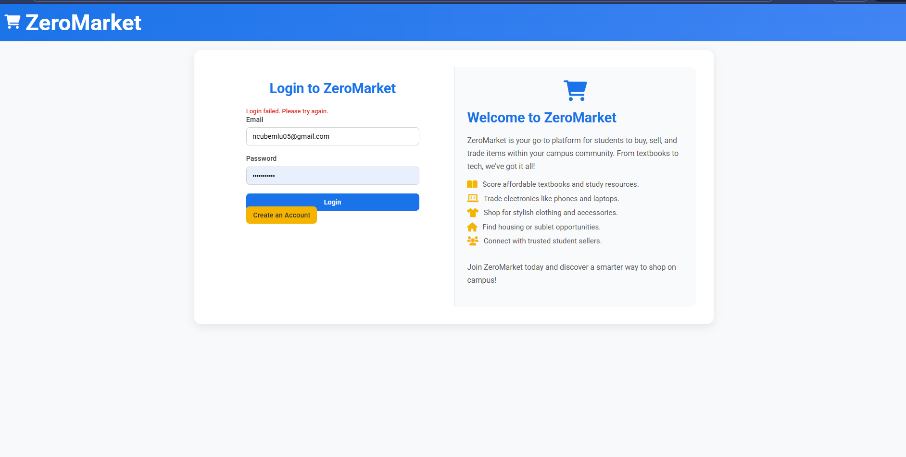
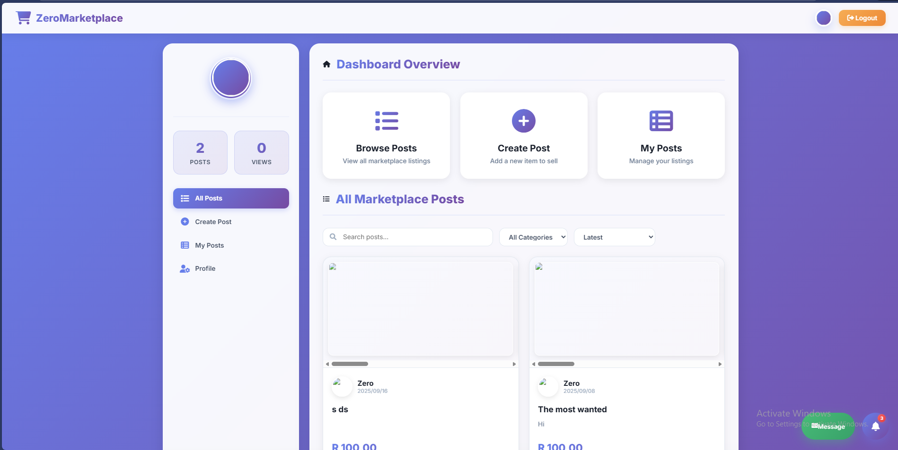
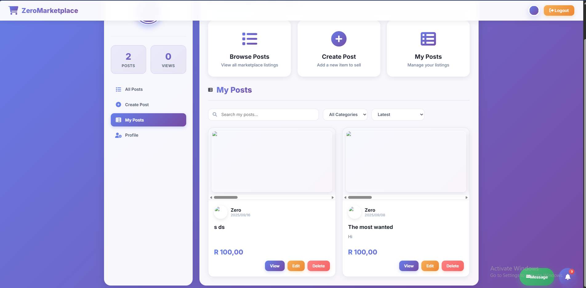
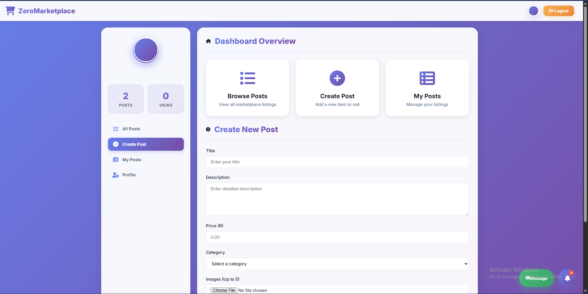
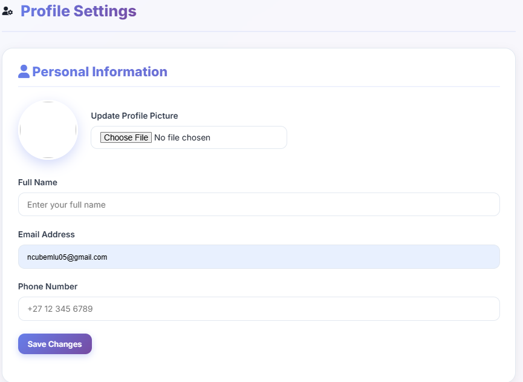
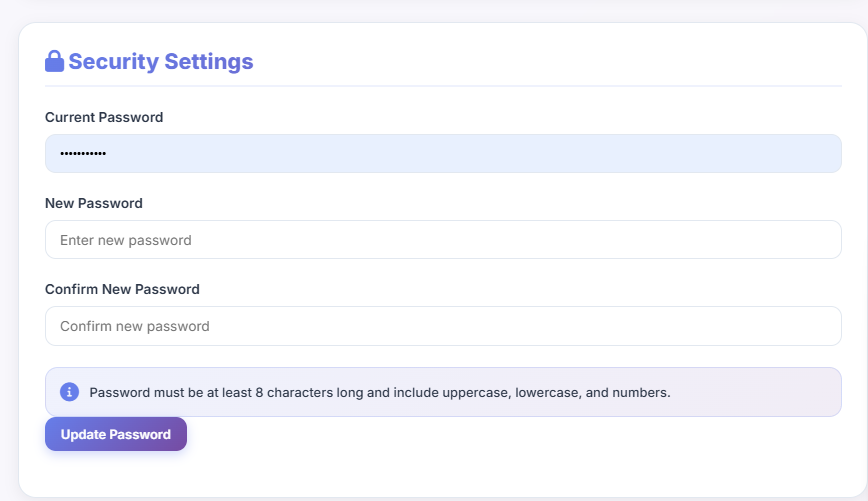

ZeroMarket 🛒
A Full-Stack Marketplace Web Application

🌐 Live Demo:
https://zeromarket-ezc8bvchd0hbdtfu.southafricanorth-01.azurewebsites.net/

📌 Overview

ZeroMarket is a full-stack marketplace web application that connects advertisers (sellers) and customers (buyers) within a structured digital trading environment.
The platform simulates a real-world marketplace similar to Facebook Marketplace, where sellers can publish and manage listings while buyers browse and interact with available products.
This project was built to demonstrate real production-style architecture, including authentication, database integration, cloud storage, role-based dashboards, and full CRUD functionality.

🎯 Project Objective
The goal of ZeroMarket was to design and deploy a scalable marketplace system that:
Supports multiple user roles
Persists data in a cloud database
Handles image uploads
Tracks post engagement (views)
Implements business logic and validation
Demonstrates real-world SaaS application flow
This is not a simple CRUD demo — it reflects how modern marketplace platforms operate internally.

👥 User Roles
🔹 Advertiser (Seller Dashboard)

Advertisers have full control over their listings through a dedicated dashboard.

They can:

✅ Create new listings with images

✅ Edit existing posts

✅ Delete listings

✅ Track number of views per listing

✅ Manage profile information

✅ Upload or update profile picture

This mimics professional seller tools found in commercial marketplace platforms.

🔹 Customer (Buyer Dashboard)

Customers interact with the marketplace through a browsing interface.

They can:

🔎 View all available listings

🖼️ View product images

📄 Open detailed listing pages

📞 Access advertiser contact information

The system focuses on content discovery and usability.

🏗️ Technical Architecture
Backend & Database

Supabase (PostgreSQL)

Cloud-hosted relational database

REST API communication

Secure data handling

Structured relational schema

Core Functionalities Implemented

🔐 User authentication system

📦 Full CRUD operations (Create, Read, Update, Delete)

🖼️ Image upload & storage

📊 Post engagement tracking (view counter logic)

👤 Role-based access control

🌍 Cloud deployment

🧠 System Design Approach

ZeroMarket was built with a real-world architecture mindset:

Separation of roles and permissions

Business logic validation

Session management

Cloud-based database integration

Scalable design principles

The project demonstrates understanding of both frontend interaction flow and backend data structure.

🚀 Deployment

The application is deployed and publicly accessible via Microsoft Azure.

This demonstrates:

Cloud deployment knowledge

Production configuration handling

Remote database connectivity

💡 What This Project Demonstrates

Full-stack web development

Database design with PostgreSQL

API integration with Supabase

Cloud storage management

Real-world marketplace workflow implementation

Deployment to a live production environment

📈 Future Improvements

Messaging system between buyers and sellers

Advanced search & filtering

Payment integration

Rating & review system

Admin moderation dashboard

👨‍💻 Developer

Developed as a portfolio project to demonstrate practical software engineering skills in building scalable, real-world web applications.

## 📸 Application Screenshots

### 🔐 Login Page

### 📊 Dashboard

### 📦 My Posts

### 📝 Create Post

### 👤 Profile

### 🔑 Change Password

